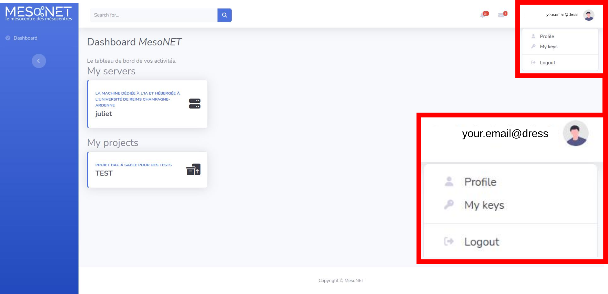
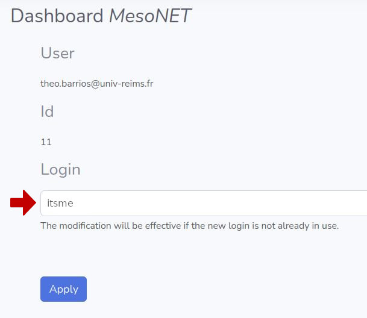

import Tabs from '@theme/Tabs';
import TabItem from '@theme/TabItem';


# Request access to a server
# Prerequisites

1) You need a validated MesoNET account. You can find the steps to obtain one [here](https://www.mesonet.fr/documentation/user-documentation/connectToMesonet).

2) You need to have entered a `Login` in your MesoNET [profile](https://www.mesonet.fr/portal/profile).


3) You need a valid SSH key. You can generate a key in a command line interface with the command :
```sh 
ssh-keygen 
```
# Access request


<Tabs>
<TabItem value="juliet" label="Juliet AI server">

The ticket center is currently under construction. In the meantime you can request access to the Juliet AI pod through the [Romeo ticket center](https://romeo.univ-reims.fr/ticket/)


To request access :
    - Select "MESONET Account Creation" under "Help Topic"
    - Provide an e-mail address to contact the owner of the account
    - Provide the username in the details of the ticket.

</TabItem>
</Tabs> 

# Define your username

To access mesonet services you are going to need a username. To define a username, you can go to your [profile] with the link or by clicking on the top right icon -> `Profile`.



The username must be entered under the `Login` field.



# Add a ssh key
This step can be performed before or after the previous one.
Go to your [key list](https://www.mesonet.fr/portal/mykeys) with the link or by clicking on the top right icon -> `My keys`.


At the bottom of the list, click on `New Key`.
Enter a `Label` for your key to identify it

:::info

Labels are not unique and are only used for information.

:::

Enter the type and value of your public key on the `Key` field.

:::note
Examples of the expected format : 

`ssh-ed25519 ThATiSthEB0DY0FAKeY`

`ssh-rsa ThisTypeOfKeyIsMuchLongerThanThatButYouGetTheIdea`
:::

Check the `Valid Key` button to validate your key. You can have as many valid keys as you want.


:::caution

⚠ In the current state, the portal has no failsafe to detect invalid or duplicate SSH keys. ⚠

⚠ Please make sure your key is valid before adding it. ⚠

Depending on what you copied it from, some newline character might have been introduced in the text and must be removed. 

:::

# Activate SSH key

Once you have been granted access to a server, it should appear on the [Dashboard](https://www.mesonet.fr/portal/dashboard)

By clicking on a computing architecture you can select which keys are activated or deactivate for this architecture.

To activate a SSH key for juliet, click on the gray button next to its label. The button will turn green. The key will be usable on juliet once the list has been refreshed.

To deactivate a SSH key, click the same button. It will turn from green to gray.

:::info
<Tabs>
<TabItem value="juliet" label="Juliet AI server">

On Juliet, the list of activated keys is refreshed every 3 hours.

</TabItem>
</Tabs> 
:::


# Revoke SSH Key

To revoke a SSH Key, go to your [key list](https://www.mesonet.fr/portal/mykeys) with the link
or by clicking on the top right icon -> `My keys`.

Click on the key label. Finally under `Validity`, check `Unvalid key`.

:::caution

- This will revoke the key for every MesoNET server.

⚠ In the current state, the portal has no failsafe to detect duplicate SSH keys. ⚠

If there are duplicate SSH keys revoking one will also revoke the others.

:::

:::tip

SSH keys that are entered cannot be modified or deleted. If you want to edit a key, you will need to revoke the first one and create a new one.

:::

